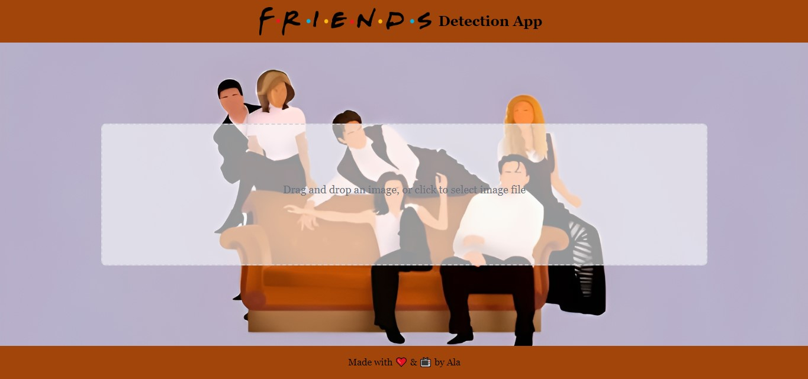

# Friends Detection App

Hey there! Welcome to the Friends Detection App 🎉. This nifty tool allows you to detect your favorite characters from the iconic '90s sitcom Friends using some cool machine learning magic.

## How to Use

1. **Drag and Drop or Click to Select an Image:** It's as easy as pie! Simply drag an image into the highlighted area or give it a click to pick an image from your device. We're all about simplicity here!

   

2. **Click Submit and Grab a Coffee:** Once you've selected an image, hit that "Submit" button, sit back, and relax. Our AI pals will get to work faster than you can say "How you doin'?".

3. **Enjoy the Results:** Voilà! In no time, we'll present you with the results, showing you which Friends character you've got in your picture-perfect snapshot.

## Sneak Peek

Take a peek at how the app works in action:

1. 
   Caption for screenshot 1.

2. 
   Caption for screenshot 2.

## Installation

Want to try it out yourself? Follow these easy steps:

1. **Clone the Repository:**

   ```bash
   git clone https://github.com/yourusername/friends-detection-app.git
