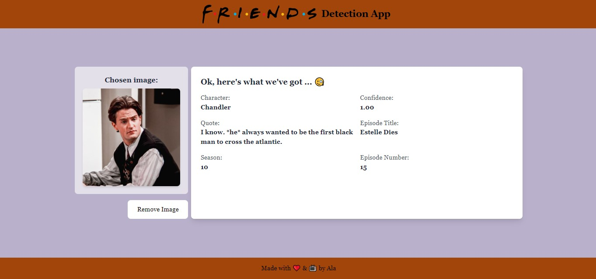

# Friends Detection App

Hey there! Welcome to the Friends Detection App 🎉. This nifty tool allows you to detect your favorite characters from the iconic '90s sitcom Friends using some cool machine learning magic.

## How to Use

1. **Drag and Drop or Click to Select an Image:** It's as easy as pie! Simply drag an image into the highlighted area or give it a click to pick an image from your device. We're all about simplicity here!

   

2. **Click Submit and Grab a Coffee:** Once you've selected an image, hit that "Submit" button, sit back, and relax. Our AI pals will get to work faster than you can say "How you doin'?".

   
   

3. **Enjoy the Results:** Voilà! In no time, we'll present you with the results, showing you which Friends character you've got in your picture-perfect snapshot and providing you with a random quote by that person and the episode which it comes from (maybe you'd like to give it a watch? 😉).
   

## Installation

Want to try it out yourself? Follow these easy steps:

1. **Clone the Repository:**

   ```bash
   git clone https://github.com/cloudala/Friends-Detection-App.git

2. **Install Python Requirements:**
   Navigate into the cloned repository and install the required Python packages using pip:
   ```bash
   cd Friends-Detection-App
   pip install -r requirements.txt

3. **Run Neo4j Docker Image:**
   Start the latest Neo4j Docker image by running the following command:
   ```docker
   docker run --name myneo4j -p 7474:7474 -p 7687:7687  -v friends_detection_data:/data -d neo4j

4. **Populate the Database:**
   Open the Neo4j browser editor (once you've run the container it will be available at http://localhost:7474) and execute the following Cypher query to populate the database:
   ```cypher
   LOAD CSV WITH HEADERS FROM 'https://raw.githubusercontent.com/cloudala/Friends-Detection-App/main/db_data/friends_quotes_after_cleanup.csv' AS row
   MERGE (author:Author {name: row.author})
   WITH author, row
   CREATE (quote:Quote {
      episode_number: toInteger(row.episode_number),
      episode_title: row.episode_title,
      quote: row.quote,
      season: toInteger(row.season)
   })
   CREATE (author)-[:HAS_QUOTE]->(quote)

5. **Run the Server:**
   Navigate into the server folder and run the Flask server:
   ```bash
   cd server
   python app.py

6. **Install Client Dependencies:**
   Open a different terminal, navigate into the client folder and install the necessary requirements:
   ```bash
   cd client
   npm install

7. **Run the Client:**
   Run the client app:
   ```bash
   npm run dev

7. **Enjoy the App:**
  Open your browser and go to http://localhost:3000 to enjoy the app 😊!
